# FreqUI 操作手册（截图版）

> 本手册基于你本机部署的 freqtrade 实例编写（dry-run 模拟盘），
> 所有截图均为实际界面。部署方式见仓库根目录 `docker-compose.yml`。

- 界面地址：<http://127.0.0.1:8081>
- 登录账号：`freqtrader`
- 登录密码：见 `user_data/config.json` 里的 `password` 字段
- 当前模式：**模拟盘（Dry-Run）**，所有买卖都是模拟的，不会动真钱

---

## 1. 打开界面并登录

浏览器打开 <http://127.0.0.1:8081>，点击右上角 **登录** 按钮，弹出登录窗口：

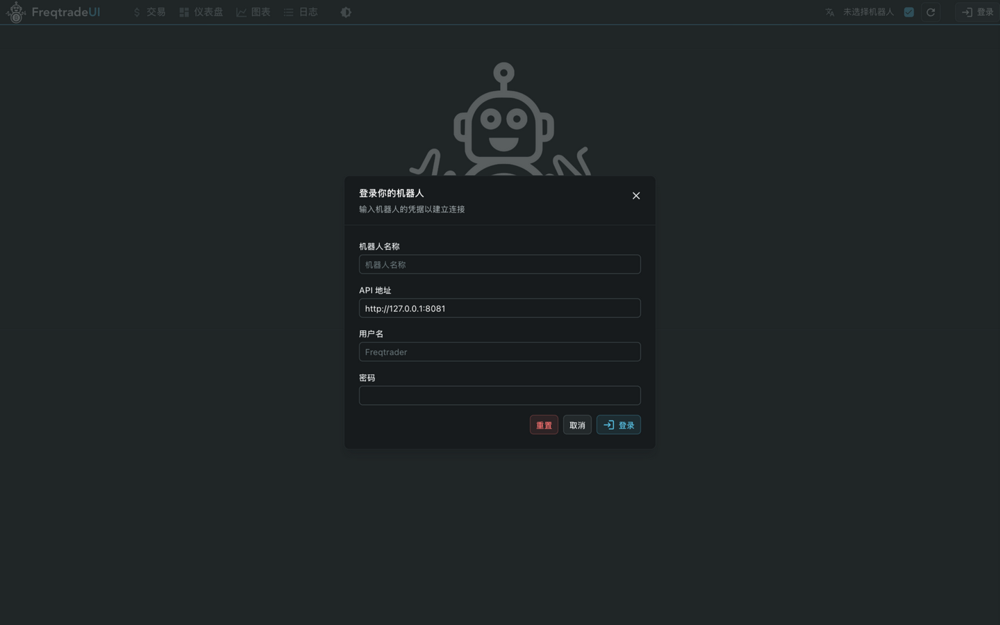

四个字段这样填：

| 字段 | 填什么 |
|---|---|
| 机器人名称 | 随意，只是显示名（如 `freqtrade`） |
| API 地址 | 保持默认（自动填好 `http://127.0.0.1:8081`） |
| 用户名 | `freqtrader` |
| 密码 | 见 `user_data/config.json` 的 `password` |

点 **登录** 后，右上角出现机器人名字和绿色 **在线** 圆点，就说明连接成功了。

> 登录信息保存在浏览器本地。下次打开一般不用重新登录；
> 如果换了浏览器或清了缓存，按上面步骤再登一次即可。

## 2. 切换界面语言（中文/English）

点击右上角的 **🌐 翻译图标**，在弹出的菜单里选 `简体中文` 或 `English`，界面立即切换：

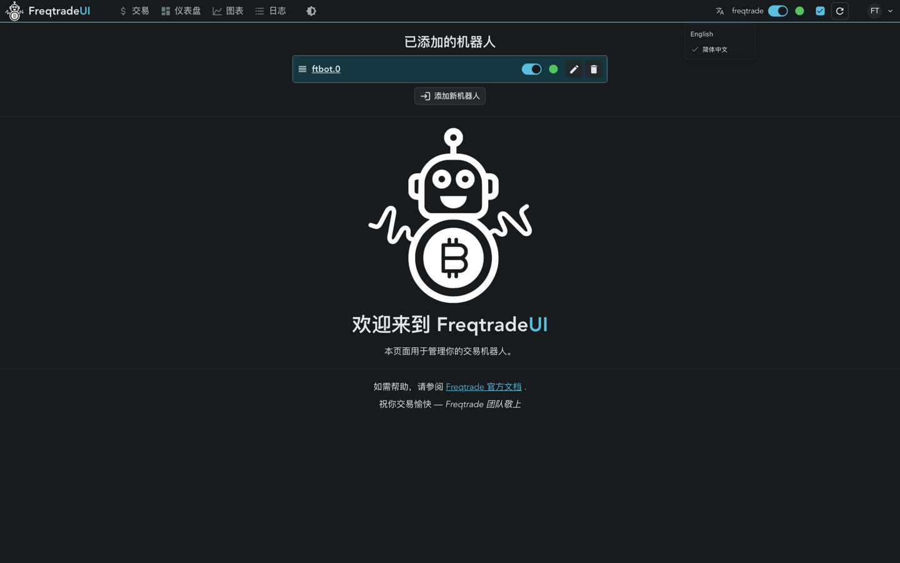

选择会被记住，下次打开还是你选的语言。也可以在 **设置页** 里切换（见第 8 节）。

## 3. 认识主界面

登录后点顶部 **交易** 进入交易页，这是最常用的页面：

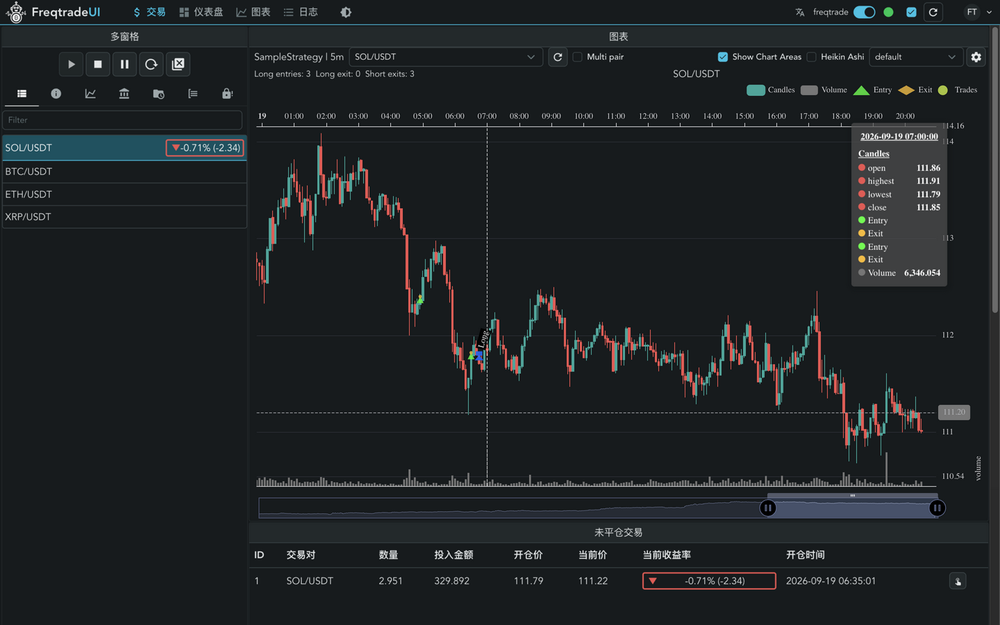

界面分四块：

1. **顶部导航栏**：交易 / 仪表盘 / 图表 / 日志 四个页面入口。
2. **右上角状态区**（从左到右）：
   - 🌐 语言切换；
   - **机器人名称**（如 `freqtrade`）+ 绿色/红色圆点 = 在线/离线；
   - 蓝色开关 = 自动刷新（保持开启即可）；
   - ↻ 刷新按钮 = 立即拉取最新数据；
   - **FT 头像** = 机器人菜单（设置 / 锁定布局 / 重置布局 / 退出登录）。
3. **左侧"多窗格"面板**：控制按钮 + 数据面板（下面细讲）。
4. **右侧"图表"**：K 线图；下方是 **未平仓交易** 和 **已平仓交易** 两张表。

## 4. 控制机器人：启动 / 停止 / 暂停 / 重载

多窗格顶部的一排按钮就是机器人的"遥控器"：

| 按钮 | 作用 |
|---|---|
| ▶ 启动交易 | 让机器人开始运行（运行中时是灰色不可点） |
| ■ 停止交易 | 完全停止，**不再处理未平仓交易** |
| ⏸ 暂停 | 停止开新仓，但继续管理手里的仓位 |
| ↻ 重载配置 | 修改 `user_data/config.json` 后点它生效（不用重启容器） |
| ⊗ 全部强制平仓 | 把当前所有持仓立即全部平掉 |
| ➕ 手动开仓 | 手动开一笔仓（默认关闭，开启方法见第 9 节） |

> 鼠标悬停在每个按钮上都会显示中文说明。
> 模拟盘下随便点没关系，反正是假钱——大胆试。

## 5. 多窗格：看机器人的数据

多窗格左侧有一列小图标，对应 7 个数据面板（默认只显示图标，鼠标悬停有提示）：

| 图标位置 | 面板 | 内容 |
|---|---|---|
| 第 1 个 | 交易对汇总 | 每个交易对的持仓和收益 |
| 第 2 个 | **概况** | 机器人版本、运行配置、总收益、启动时间等 |
| 第 3 个 | 收益 | 详细的收益指标 |
| 第 4 个 | **余额** | 当前钱包余额 |
| 第 5 个 | 时间分布 | 按天/周/月统计收益 |
| 第 6 个 | 交易对列表 | 白名单里的交易对 |
| 第 7 个 | 交易对锁定 | 被锁定暂时不能交易的交易对 |

**概况面板**长这样（可以看到运行版本、配置、收益率、启动时间）：

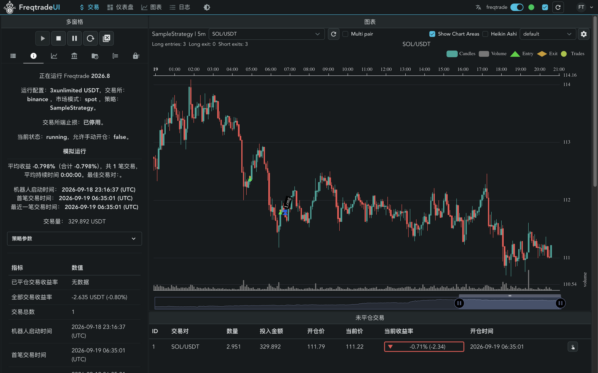

**余额面板**（模拟盘的假余额，合计 988 USDT = 初始 1000 + 当前浮亏）：

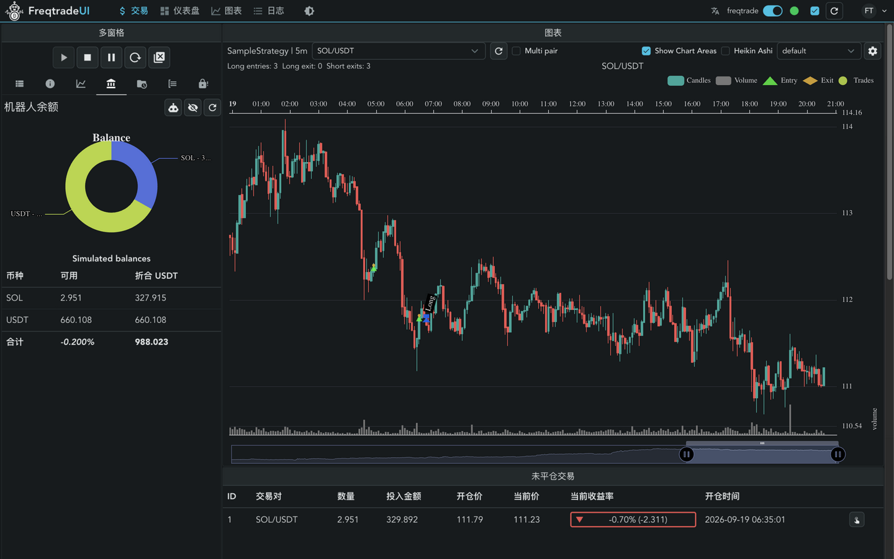

## 6. 看懂两张交易表

页面下方的两张表格是核心信息：

- **未平仓交易**：当前手里持有的仓位。列含义：
  - `投入金额`：这笔仓位花了多少 USDT；
  - `开仓价` / `当前价`：买入价和现在的价格；
  - `当前收益率`：红色 ▼ 是亏损、绿色 ▲ 是盈利（括号里是亏/赚的 USDT 数量）。
- **已平仓交易**：已经卖出的历史交易，多一列 `平仓原因`（如 roi=止盈、stop_loss=止损、exit_signal=策略卖出信号）。

**点击表格里的任意一行**，会打开这笔交易的**详情面板**（手续费、止损位、订单明细等）。

每行最右侧有一个 👆 **操作** 按钮，点开是针对这一笔交易的菜单：

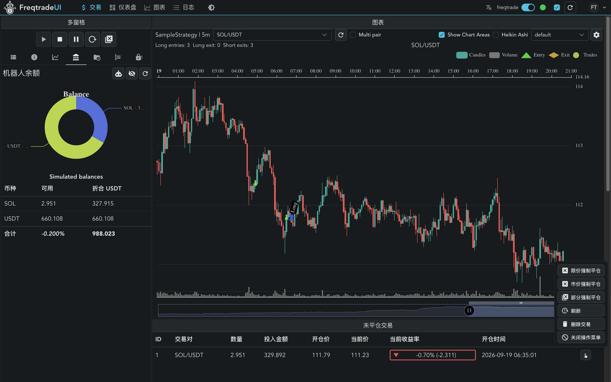

| 菜单项 | 作用 |
|---|---|
| 限价强制平仓 | 挂限价单立即卖出这笔仓位 |
| 市价强制平仓 | 按市价立即卖出（最快但滑点大） |
| 部分强制平仓 | 只卖一部分 |
| 刷新 | 重新从机器人拉取这笔交易的最新状态 |
| 删除交易 | 从数据库里删掉这笔记录（仅模拟盘随便用） |

> 点危险的按钮（如强平/删除）会弹出确认框，确认后才执行：

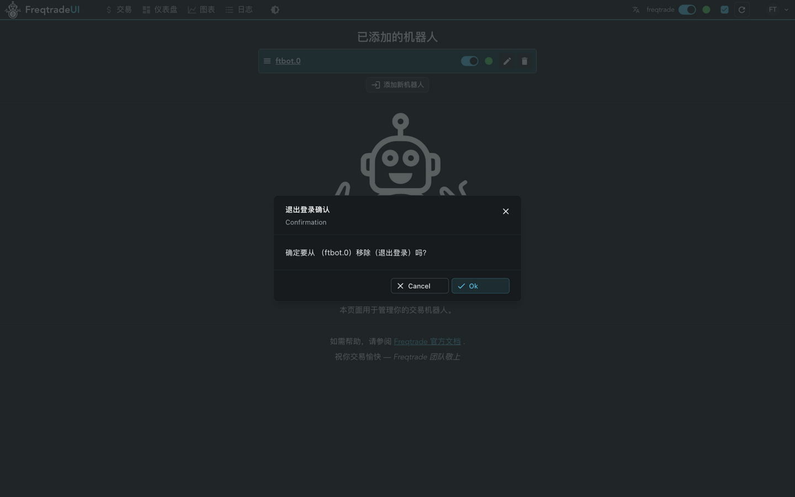

## 7. 图表页：看 K 线和买卖信号

顶部点 **图表** 进入全屏 K 线页：

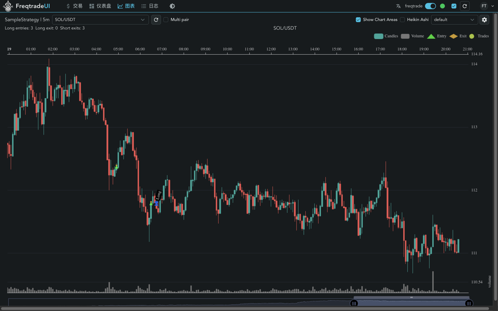

- 左上角可以**切换交易对**和 K 线周期；
- 图上绿色 ▲ 是策略的**买入信号**、黄色 ◆ 是卖出信号，蓝色标记是**实际开仓点**；
- `Multi pair`：同时对比多个交易对；
- `Heikin Ashi`：切换成平均 K 线；
- 右上角 ⚙ 可以配置图上显示哪些指标线（配合策略里的 `plot_config`）。

## 8. 仪表盘：全局收益总览

顶部点 **仪表盘**，多机器人时这里是总控制台：

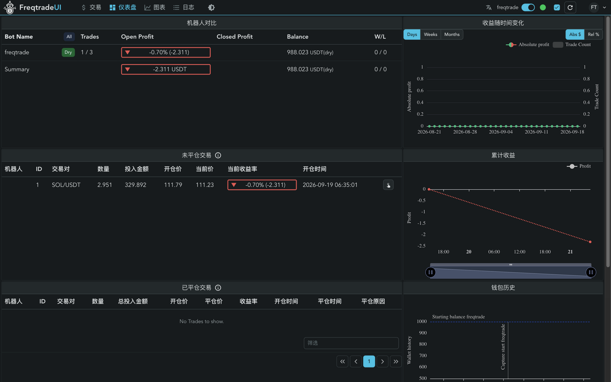

- **机器人对比**：每个机器人的持仓、盈亏、余额（只有一个机器人时就是它自己）；
- **收益随时间变化**：可切换 天/周/月，绝对值/百分比；
- **累计收益**、**钱包历史**：资金曲线；
- 未平仓/已平仓交易汇总表。

## 9. 手动开仓（需要先开启）

默认配置里手动开仓是关闭的（我们部署时已帮你打开）。交易页控制按钮区会多一个 ➕ 按钮，
点击后填写表单：

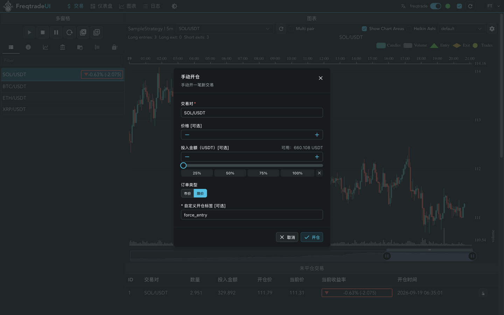

- **交易对**：要买的交易对；
- **价格**：留空 = 按当前市价买入；填一个价 = 挂在那个价格等成交；
- **投入金额**：留空 = 按机器人配置的每笔金额；也可以拖滑块或点 25%/50% 快捷键；
- **订单类型**：市价 / 限价。

点 **开仓** 前想清楚：虽然是模拟盘，但这会立即产生一笔真实流程的模拟订单。

> 如果以后想把手动开仓关掉：把 `user_data/config.json` 里的
> `"force_entry_enable": true` 改回 `false`，然后点界面上的 ↻ 重载配置（或 `docker compose restart`）。

## 10. 日志页：排查问题第一现场

顶部点 **日志**，能看到机器人运行日志（同 `user_data/logs/freqtrade.log`）：

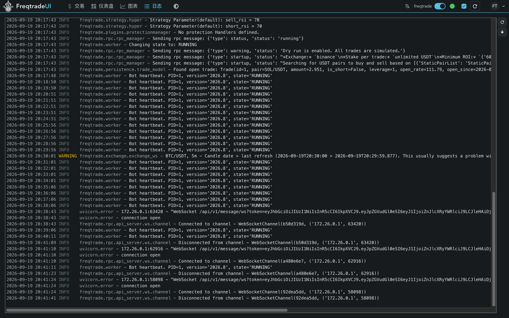

- 黄色 **WARNING** 一般可忽略（如某个交易对数据延迟）；
- 红色 **ERROR** / CRITICAL 才需要处理；
- 右侧两个按钮：↻ 刷新日志、⬇ 滚动到底部。

## 11. 设置页：个性化界面

顶部点 ⚙ 图标（或 FT 菜单 → 设置）：

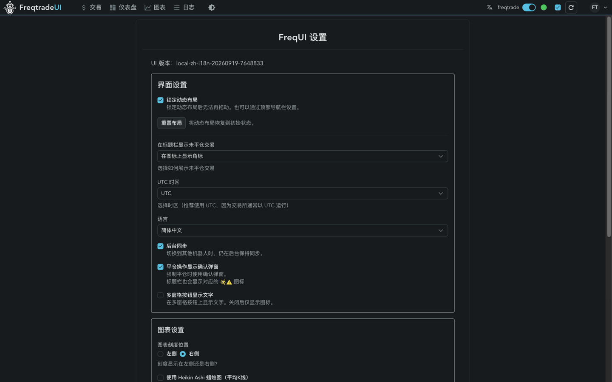

常用的几项：

| 设置 | 建议 |
|---|---|
| 锁定动态布局 | 锁住后面板不能拖动（防止误拖） |
| 重置布局 | 面板拖乱了点它恢复默认 |
| UTC 时区 | 保持 UTC（交易所都用 UTC，方便对时间） |
| **语言** | 中文 / English 切换 |
| 平仓操作显示确认弹窗 | 强平前弹确认框，建议开启 |
| 多窗格按钮显示文字 | 面板标签显示文字而不是图标（新手建议打开） |

## 12. 日常操作速查（docker 命令）

```bash
cd /Users/liu/Documents/go/gopath/src/rust-pro/freqtrade

docker compose logs -f          # 看实时日志
docker compose restart          # 改了 config.json / 策略后重启
docker compose stop             # 停止机器人
docker compose start            # 再次启动
docker compose down             # 删除容器（交易数据保留在 user_data/）
```

- **改策略**：编辑 `user_data/strategies/SampleStrategy.py`（或放你自己的策略文件），
  然后 `docker compose restart`。
- **改配置**：编辑 `user_data/config.json` 后 `docker compose restart`。
- **改登录密码**：改 `config.json` 里 `api_server.password` 后重启，并在网页上重新登录。

## 13. 常见问题

**Q：机器人一直不买，正常吗？**
正常。SampleStrategy 的入场条件比较苛刻（RSI 上穿 30 + 多重过滤），可能几天才触发一次。
想看它"动起来"，可以用第 9 节的手动开仓体验完整流程。

**Q：哪几个地方还是英文？**
三处小地方：① 已平仓交易为空时的占位文字 `No Trades to show.`；
② 确认弹窗上的 `Confirmation / Cancel / Ok` 按钮；
③ 图表内部的图例（Candles、Volume 等）。
这些属于尚未汉化的组件和图表库，不影响使用。

**Q：K 线不显示 / 提示网络错误？**
机器人需要访问币安接口拉数据。如果网络环境受限，需要给 Docker 配置代理，
或把 `config.json` 里的 `exchange.name` 换成能访问的交易所。

**Q：想实盘怎么办？**
在 `config.json` 填入交易所 API key/secret、把 `dry_run` 改为 `false`、`dry_run_wallet` 可删除，
`docker compose restart`。**实盘前务必先在模拟盘跑顺整个流程。**

**Q：界面变回英文了？**
如果执行过 `freqtrade install-ui` 会覆盖回官方英文版。
重新构建安装中文版的方法见 `../frequi/docs/多语言指南.md`。

---

*手册截图生成于 2026-09-19，界面版本 local-zh-i18n-20260919。*
